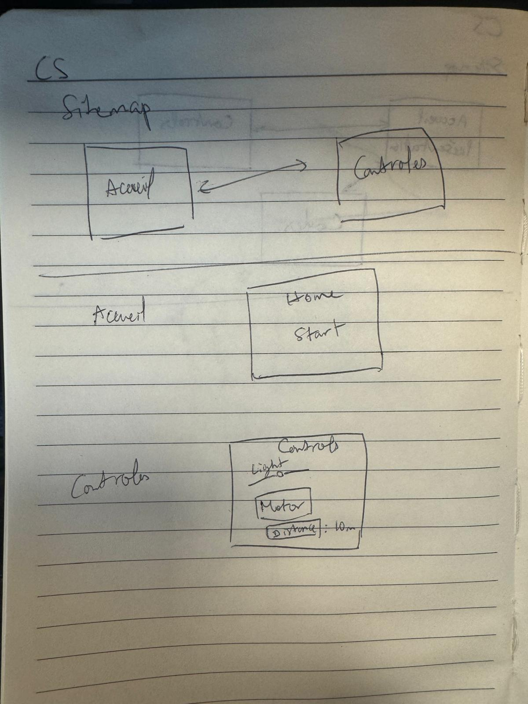

# workshop

https://www.figma.com/design/z8aAbKSaDlFpRoarhID63B/figma?node-id=0-1&t=SwbE4bE2Zuq2p3hy-1
https://youtube.com/shorts/6BuwmmOGK7I

Ce workshop et le projet que j'ai réalisé pourra m'être utile pour mon projet d'innovation de bras robotique. 
Inputs: bouton et capteur de distance à ultrasons
Outputs: LED et moteur DC 

Le bouton permet d'activer une lampe virtuelle sur le site. 
La distance captée est affichée sur le site web. 
La LED est connectée en analog et s'allume selon un potentiomètre virtuelle.
Le moteur est connecté à un transistor qui s'active depuis un bouton sur le site. 

Suvaddhano LY